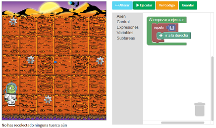

pilas-engine-bloques
====================

Una aplicación experimental para fomentar el aprendizaje
de la programación usando [pilas-engine](http://www.pilas-engine.com.ar) y
[blockly](https://developers.google.com/blockly/) (estamos usando una versión propia de [blockly](https://github.com/sawady/blockly)).





Instalación para desarrolladores
--------------------------------

Antes de comenzar, necesitas tener instalado ``nodejs`` (que
viene con ``npm`` incluido) y las dependencias ``bower``, ``grunt``, ``grunt-cli`` y ``ember-cli``.

Para instalar ``nodejs`` podés leer el [siguiente tutorial de instalación](http://examplelab.com.ar/como-instalar-nodejs-en-huayra-linux/), y
para instalar las otras dependencias podés ejecutar los comandos:

```
sudo npm install -g bower grunt grunt-cli ember-cli
```

Luego, para instalar la aplicación en sí:

```
git clone http://github.com/hugoruscitti/pilas-engine-bloques
cd pilas-engine-bloques
npm install
bower install
```

Una vez hecho esto, invocando a ``make`` vas a ver los comandos más comunes para
utilizar, y si algo de lo que querés hacer no está ahí, también vas a poder
usar los comandos ``ember``, ``npm`` o ``grunt``.

Antes de ejecutar ``make actualizar`` necesitás bajar los repos de Pilasweb y Blockly (este a su vez necesita bajar closure de Google). Haciendo ``make bajar_dependencias`` se clonan los repos correspondientes, que se ubican en el mismo nivel en el que se encuentre la carpeta de Pilas-bloques.
